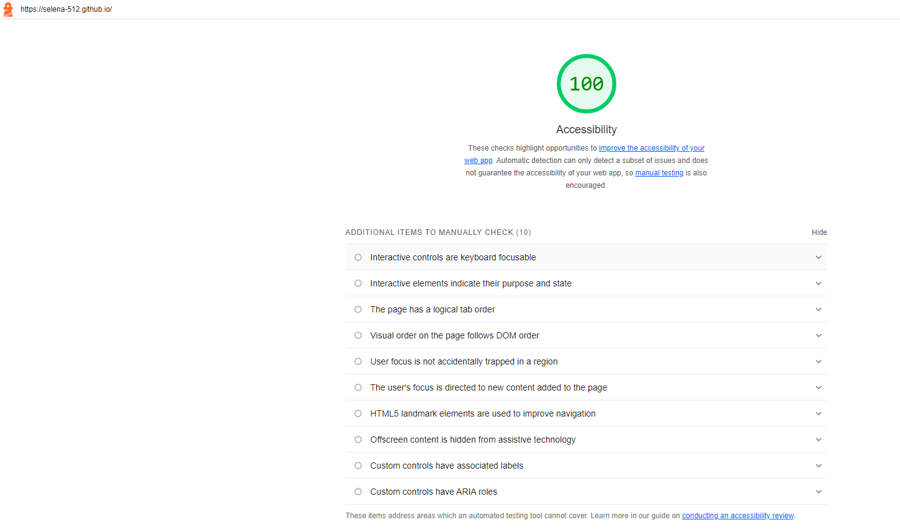
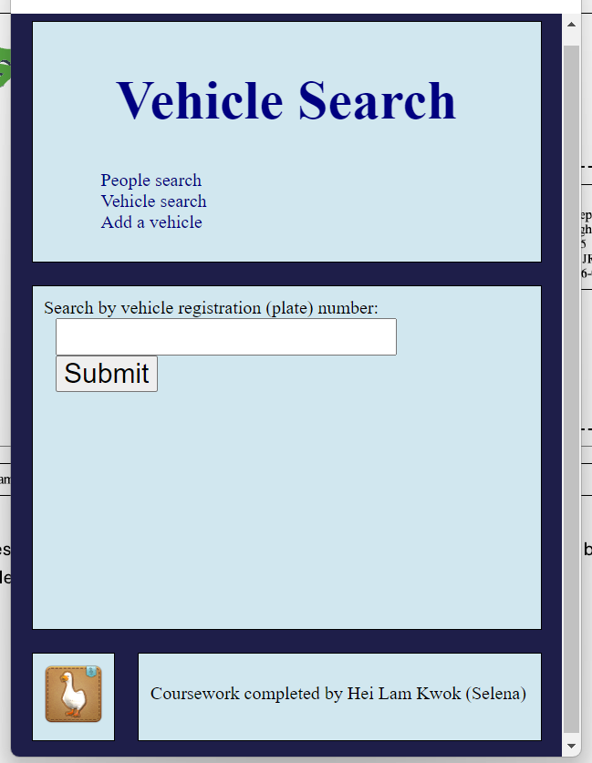

# Markdown report
This file documents the additional work done for the coursework.

## Accessibility
The coursework has been accessed using Lighthouse.\

The above image shows the score for this website is 100, and the website link can be seen at the top left corner.\
All HTML requirements have also been met. 

## Responsiveness
The front end appearance will adjust acoordingly to the screen size.\ 
This is done in the website-style.css file, in line 96 - 111, using CSS media queries.

And the following image shows the result of this code.\

## Playwright tests