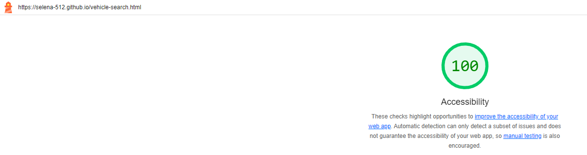
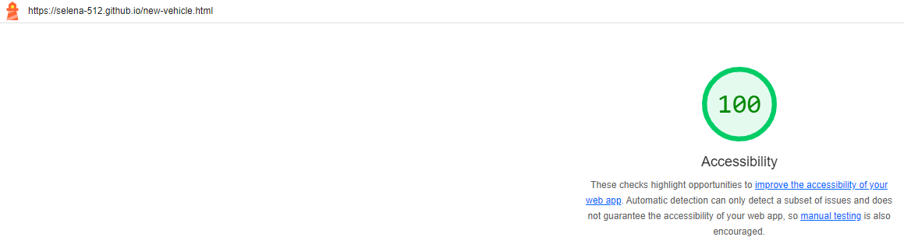
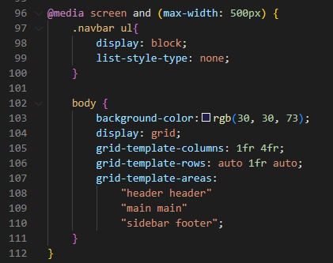
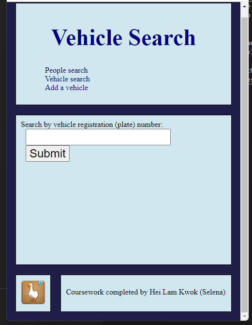

# Markdown report
This file documents the additional work done for the coursework.

## Accessibility
The coursework has been accessed using Lighthouse.\

The above image shows the score for this website is 100, and the website link can be seen at the top left corner.\
All other pages also have a score of 100 for accessibility.

\
All HTML requirements have also been met. 

## Responsiveness
The front end appearance will adjust acoordingly to the screen size.\ 
This is done in the website-style.css file, in line 96 - 111, using CSS media queries, which is shown in the below code excerpt.\

And the following image shows the result of this code.\

This also works for the other pages of the website.

## Playwright tests

## 404 page
An additional custom 404 page was created, which contains nav links for the user to navigate back to the correct pages of the site. This can be seen in the 404.html.
