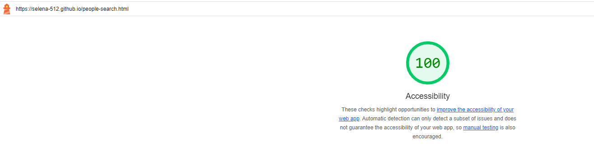

# Markdown report
This file documents the additional work done for the coursework.

## Accessibility
The coursework has been accessed using Lighthouse.\

The above image shows the score for this website is 100, and the website link can be seen at the top left corner.\
All other pages also have a score of 100 for accessibility.

\
To achieve good accessibility, I have added alternative text for images. Another issue was that touch targets did not have sufficient size or spacing, which I solved by setting them to be 24px. (website-style.css, line 59-62)
All HTML requirements have also been met. 

## Responsiveness
The front end appearance will adjust acoordingly to the screen size.\ 
This is done in the website-style.css file, in line 96 - 111, using CSS media queries, which is shown in the below code excerpt.\

And the following image shows the result of this code.\

This also works for the other pages of the website.

## Playwright tests
I have written Playwright tests based on the PDF (page 8 and 9) requirements. For add vehicle test case 1 and 2, playwright will click the vehicle search page and search for the newly addded registration number.
Below is the list of playwright tests. All have been passed.

And for adding vehicle test cases, this is the result in the database.

## Database
View is used in supabase for the vehicle search, and the SQL is shown in the below image. This is to account for cases where there is a car entry but not a corresponding owner in the people database. Left join will allow a field in the vehicle table with a null value to show.

For both People and Vehicle table, the RLS row level security is turned off, as new db inserts could not be done when it is turned on.

## 404 page
An additional custom 404 page was created, which contains nav links for the user to navigate back to the correct pages of the site. This can be seen in the 404.html.
